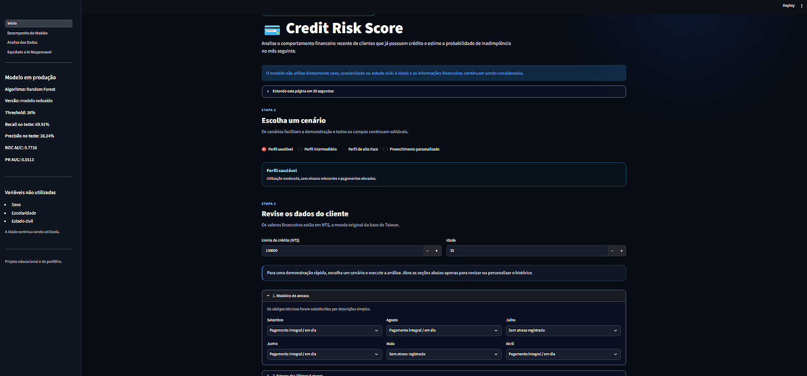
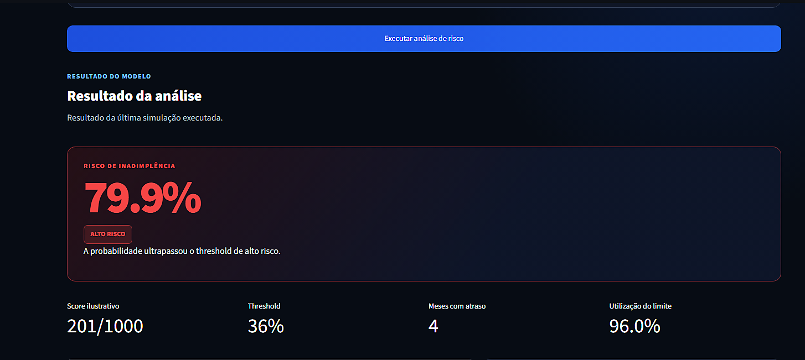
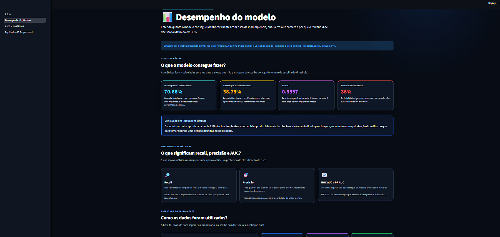
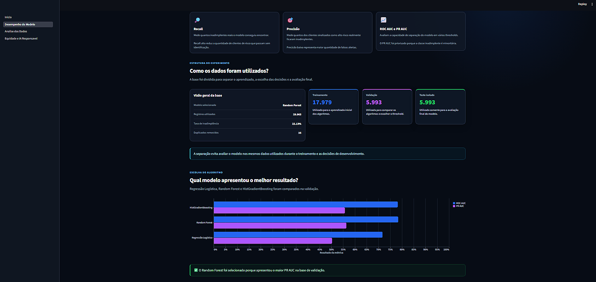
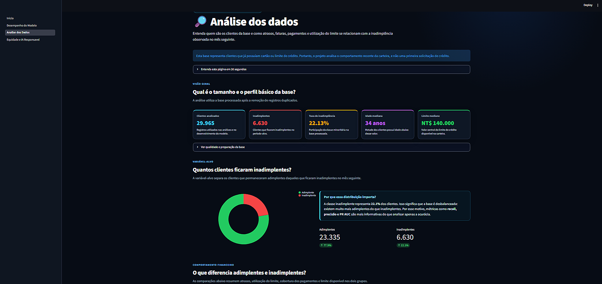
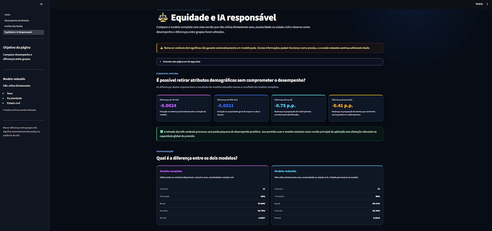

# Credit Risk Score — Machine Learning

Aplicação de Ciência de Dados desenvolvida em Python para estimar o risco de um cliente de cartão de crédito ficar inadimplente no mês seguinte, utilizando seu comportamento financeiro dos últimos seis meses.

O projeto implementa um pipeline completo de Machine Learning, incluindo preparação de dados, análise exploratória, comparação de algoritmos, seleção de threshold, avaliação em teste isolado, análise de importância das variáveis, estudo de equidade e publicação de uma aplicação interativa com Streamlit.

## Demonstração online

A aplicação está disponível em:

[https://victorvinny-credit-risk.streamlit.app](https://victorvinny-credit-risk.streamlit.app)

> O projeto possui finalidade educacional e de portfólio. Não deve ser utilizado para decisões reais de crédito.

---

## Interface da aplicação

### Página inicial

A página principal permite escolher cenários prontos ou preencher manualmente o histórico financeiro do cliente.



### Resultado da análise de risco

O sistema apresenta a probabilidade estimada de inadimplência, o score ilustrativo, a classificação operacional e os principais indicadores comportamentais.



### Desempenho do modelo

A página apresenta as métricas obtidas na base de teste isolada, incluindo recall, precisão, PR AUC, ROC AUC e threshold.



### Comparação dos algoritmos

Foram comparados Regressão Logística, Random Forest e HistGradientBoosting. O Random Forest foi selecionado por apresentar o melhor PR AUC na validação.



### Análise exploratória dos dados

A aplicação compara o comportamento de clientes adimplentes e inadimplentes, incluindo atrasos, pagamentos, faturas, limite de crédito e utilização do limite.



### Equidade e IA responsável

A página compara o modelo completo com o modelo reduzido e analisa diferenças de desempenho entre grupos.



---

## Sobre o projeto

Este projeto implementa um modelo comportamental de risco de crédito, também conhecido como **Behavioral Credit Score**.

Diferentemente de um modelo utilizado em uma primeira solicitação de crédito, este sistema analisa clientes que já possuem cartão ou limite disponível.

O modelo utiliza informações como:

- histórico de atrasos;
- valores das faturas;
- valores pagos;
- utilização do limite;
- limite de crédito;
- idade;
- comportamento financeiro dos últimos seis meses.

Com base nesses dados, o sistema estima a probabilidade de o cliente ficar inadimplente no mês seguinte.

### Possíveis aplicações de negócio

Um modelo desse tipo pode apoiar atividades como:

- monitoramento de clientes;
- identificação antecipada de risco;
- priorização de análises;
- gestão de carteira;
- revisão de limites;
- definição de estratégias de cobrança;
- prevenção de inadimplência.

O modelo deve funcionar como apoio à decisão, e não como decisão automática e definitiva.

---

## Machine Learning utilizado

O projeto utiliza **Machine Learning supervisionado** para resolver um problema de **classificação binária**.

A variável-alvo possui duas classes:

| Classe | Significado |
|---|---|
| 0 | Cliente adimplente |
| 1 | Cliente inadimplente |

Foram comparados três algoritmos:

| Algoritmo | Função no projeto |
|---|---|
| `LogisticRegression` | Modelo linear utilizado como baseline |
| `RandomForestClassifier` | Modelo baseado em múltiplas árvores de decisão |
| `HistGradientBoostingClassifier` | Modelo de boosting capaz de capturar relações não lineares |

O algoritmo selecionado foi o:

## Random Forest Classifier

O Random Forest apresentou o melhor **PR AUC** na base de validação.

Esse algoritmo combina diversas árvores de decisão. Cada árvore produz uma previsão, e o resultado final é calculado a partir do conjunto das árvores.

Entre suas vantagens para este projeto estão:

- capacidade de capturar relações não lineares;
- identificação de interações entre variáveis;
- pouca necessidade de transformação de escala;
- funcionamento adequado com variáveis financeiras e comportamentais;
- possibilidade de calcular importância global das variáveis.

---

## Objetivo

O objetivo do projeto é demonstrar a construção de uma solução de Machine Learning orientada a um problema de negócio do setor financeiro.

Além da previsão, o projeto busca responder às seguintes perguntas:

- Qual algoritmo apresenta melhor capacidade de identificar inadimplentes?
- Qual threshold oferece equilíbrio adequado entre recall e precisão?
- Quais variáveis são mais utilizadas pelo modelo?
- Quanto de desempenho é perdido ao remover variáveis demográficas?
- O modelo apresenta resultados diferentes entre grupos?
- Como transformar uma previsão técnica em uma interface compreensível?

---

## Fluxo do projeto

```mermaid
flowchart LR
    A[Dataset UCI] --> B[Preparação dos dados]
    B --> C[Análise exploratória]
    C --> D[Treinamento dos modelos]
    D --> E[Validação dos algoritmos]
    E --> F[Seleção do Random Forest]
    F --> G[Seleção do threshold]
    G --> H[Teste final isolado]
    H --> I[Análise de equidade]
    I --> J[Aplicação Streamlit]
```



---

## Dataset

Foi utilizado o dataset **Default of Credit Card Clients**, disponibilizado pela UCI Machine Learning Repository.

Fonte:

[UCI Machine Learning Repository — Default of Credit Card Clients](https://archive.ics.uci.edu/dataset/350/default+of+credit+card+clients)

A base contém dados históricos de clientes de cartão de crédito de Taiwan.

### Características da base

- 30.000 registros originais;
- 23 variáveis explicativas;
- variável-alvo binária;
- seis meses de histórico financeiro;
- informações de faturas;
- informações de pagamentos;
- histórico mensal de atrasos;
- limite de crédito;
- dados demográficos.

### Preparação realizada

Durante o processamento:

- 35 registros duplicados foram removidos;
- 29.965 registros foram utilizados;
- não foram identificados valores ausentes;
- os nomes das variáveis foram traduzidos;
- categorias especiais foram agrupadas;
- os tipos de dados foram validados;
- a variável-alvo foi padronizada;
- a taxa de inadimplência ficou em aproximadamente 22,13%.

Os valores financeiros da base estão registrados em **NT$ — New Taiwan Dollar**.

---

## Tecnologias utilizadas

| Tecnologia | Utilização |
|---|---|
| Python | Linguagem principal do projeto |
| Pandas | Limpeza, transformação e análise dos dados |
| NumPy | Operações numéricas |
| Scikit-learn | Treinamento, validação e avaliação dos modelos |
| Random Forest | Algoritmo principal de Machine Learning |
| Regressão Logística | Modelo baseline |
| HistGradientBoosting | Modelo comparativo |
| Streamlit | Desenvolvimento da aplicação web |
| Altair | Construção dos gráficos interativos |
| Joblib | Salvamento e carregamento dos modelos |
| ucimlrepo | Obtenção do dataset da UCI |
| Git | Versionamento do projeto |
| GitHub | Armazenamento e apresentação do código |
| Streamlit Community Cloud | Publicação da aplicação |
| CSV e JSON | Armazenamento de dados, métricas e configurações |

---

## Metodologia

### 1. Preparação dos dados

A preparação inclui:

- download do dataset com `ucimlrepo`;
- tradução dos nomes das variáveis;
- ajuste de categorias especiais;
- conversão dos tipos de dados;
- validação da variável-alvo;
- identificação de registros duplicados;
- remoção de duplicados;
- verificação de valores ausentes;
- geração da base processada.

### 2. Divisão da base

A base foi dividida em três conjuntos:

| Conjunto | Percentual | Finalidade |
|---|---:|---|
| Treinamento | 60% | Aprendizado dos algoritmos |
| Validação | 20% | Comparação dos modelos e seleção do threshold |
| Teste | 20% | Avaliação final isolada |

A divisão foi realizada de forma estratificada para preservar aproximadamente a mesma proporção de inadimplentes em cada conjunto.

A base de teste permaneceu isolada durante as decisões de desenvolvimento.

### 3. Treinamento dos algoritmos

Foram treinados:

- Regressão Logística;
- Random Forest;
- HistGradientBoosting.

Os algoritmos foram comparados na base de validação.

### 4. Seleção do modelo

O principal critério de seleção foi o **PR AUC**.

Essa métrica foi priorizada porque a classe inadimplente representa aproximadamente 22% dos registros, caracterizando um problema com classes desbalanceadas.

O Random Forest apresentou o melhor PR AUC e foi selecionado.

### 5. Seleção do threshold

O modelo produz uma estimativa contínua de risco entre 0 e 1.

O threshold transforma essa estimativa em uma classificação:

```text
Probabilidade abaixo do threshold:
cliente não classificado como alto risco.

Probabilidade igual ou superior ao threshold:
cliente classificado como alto risco.
```

O threshold foi escolhido na base de validação, buscando:

- recall próximo de 70%;
- maior precisão possível dentro desse nível de recall.

O threshold selecionado foi de **36%**.

### 6. Avaliação final

Após a escolha do algoritmo e do threshold, o resultado foi calculado na base de teste isolada.

Foram avaliadas as métricas:

- acurácia;
- precisão;
- recall;
- F1-score;
- ROC AUC;
- PR AUC;
- matriz de confusão;
- falsos positivos;
- falsos negativos.

---

## Modelo utilizado na aplicação

Foram desenvolvidas duas versões do Random Forest.

### Modelo completo

Utiliza as 23 variáveis disponíveis, incluindo:

- sexo;
- escolaridade;
- estado civil.

### Modelo reduzido

Não utiliza diretamente:

- sexo;
- escolaridade;
- estado civil.

A idade continua sendo utilizada.

O modelo reduzido foi escolhido para a página principal da aplicação porque apresentou uma perda muito pequena de desempenho em relação ao modelo completo.

---

## Resultados do modelo reduzido

Resultados obtidos na base de teste isolada:

| Métrica | Resultado |
|---|---:|
| Acurácia | 68,46% |
| Precisão | 38,34% |
| Recall | 69,91% |
| F1-score | 49,52% |
| ROC AUC | 0,7718 |
| PR AUC | 0,5513 |
| Threshold | 36% |

### Interpretação do recall

O recall de 69,91% indica que o modelo identificou aproximadamente:

> 70 de cada 100 clientes que realmente ficaram inadimplentes.

### Interpretação da precisão

A precisão de 38,34% indica que:

> De cada 100 clientes classificados como alto risco, aproximadamente 38 realmente ficaram inadimplentes.

O resultado demonstra que o modelo possui capacidade útil de triagem, mas também produz falsos alertas.

Por isso, não deve ser utilizado isoladamente para uma decisão automática.

---

## Comparação entre os modelos

| Métrica | Modelo completo | Modelo reduzido |
|---|---:|---:|
| Acurácia | 68,80% | 68,46% |
| Precisão | 38,75% | 38,34% |
| Recall | 70,66% | 69,91% |
| F1-score | 50,05% | 49,52% |
| ROC AUC | 0,7739 | 0,7718 |
| PR AUC | 0,5537 | 0,5513 |
| Threshold | 36% | 36% |

A remoção de sexo, escolaridade e estado civil provocou:

- redução de 0,0024 no PR AUC;
- redução de 0,0021 no ROC AUC;
- redução de 0,75 ponto percentual no recall;
- redução de 0,41 ponto percentual na precisão.

A diferença foi considerada pequena para a finalidade educacional do projeto.

---

## Matriz de confusão

No teste do modelo completo, foram obtidos:

| Resultado | Quantidade |
|---|---:|
| Verdadeiros negativos | 3.186 |
| Falsos positivos | 1.481 |
| Falsos negativos | 389 |
| Verdadeiros positivos | 937 |

### Verdadeiro positivo

Cliente que ficou inadimplente e foi identificado corretamente como alto risco.

### Verdadeiro negativo

Cliente que permaneceu adimplente e não foi classificado como alto risco.

### Falso positivo

Cliente que permaneceu adimplente, mas foi classificado como alto risco.

Em uma aplicação real, esse erro poderia gerar análise adicional ou alguma restrição indevida.

### Falso negativo

Cliente que ficou inadimplente, mas não foi identificado pelo modelo.

Esse erro representa um risco que passou sem sinalização preventiva.

---

## Política operacional da aplicação

A aplicação utiliza três faixas ilustrativas:

| Probabilidade estimada | Classificação operacional |
|---|---|
| Abaixo de 26% | Aprovação sugerida |
| De 26% até menos de 36% | Análise manual |
| 36% ou mais | Alto risco |

A faixa de análise manual é uma regra operacional adicional criada para a demonstração.

O modelo original produz uma estimativa de risco, e não uma decisão definitiva de crédito.

O score exibido na aplicação também é ilustrativo:

```text
Score = (1 - probabilidade estimada) × 1.000
```

Esse score não corresponde a um score oficial de mercado.

---

## Importância das variáveis

A análise de importância global do modelo completo indicou maior utilização de variáveis relacionadas a:

1. status de pagamento de setembro;
2. status de pagamento de agosto;
3. valor pago em setembro;
4. status de pagamento de julho;
5. limite de crédito;
6. valor da fatura de setembro.

O status de pagamento mais recente apresentou aproximadamente 18,91% da importância global.

A importância foi calculada com base na redução de impureza das árvores do Random Forest.

Essa técnica indica quanto cada variável foi utilizada pelo modelo, mas possui limitações:

- não explica individualmente uma previsão;
- não informa diretamente se um valor aumentou ou reduziu o risco;
- não representa causalidade;
- pode favorecer variáveis com maior variedade de valores.

---

## Equidade e IA responsável

O projeto inclui uma análise de equidade entre grupos de:

- sexo;
- escolaridade;
- estado civil;
- faixa de idade.

Foram analisadas métricas como:

- taxa de classificação como alto risco;
- precisão;
- recall;
- taxa de falso positivo;
- taxa de falso negativo;
- taxa real de inadimplência.

### Por que remover variáveis demográficas?

A versão principal não utiliza diretamente sexo, escolaridade ou estado civil.

Essa decisão busca reduzir o uso direto de características demográficas sem provocar uma perda relevante de desempenho.

### A remoção garante equidade?

Não.

Remover variáveis sensíveis não elimina automaticamente possíveis efeitos discriminatórios.

Isso ocorre porque:

- outras variáveis podem funcionar como proxies;
- a idade continua sendo utilizada;
- grupos podem possuir taxas reais diferentes;
- algumas amostras possuem poucos registros;
- reduzir uma diferença pode aumentar outra;
- diferentes conceitos de equidade podem gerar conclusões diferentes.

A análise não demonstra que um dos modelos seja universalmente justo.

---

## Páginas da aplicação

### Início

Permite realizar uma análise comportamental individual.

A página contém:

- cenários pré-configurados;
- histórico de atrasos;
- faturas dos últimos seis meses;
- pagamentos dos últimos seis meses;
- resumo financeiro;
- probabilidade estimada de inadimplência;
- score ilustrativo;
- classificação operacional;
- indicadores de utilização do limite;
- cobertura dos pagamentos;
- alertas comportamentais.

### Desempenho do Modelo

Apresenta:

- comparação entre os algoritmos;
- estrutura de treino, validação e teste;
- métricas do modelo;
- explicação de recall, precisão e AUC;
- matriz de confusão;
- análise de falsos positivos e falsos negativos;
- seleção do threshold;
- importância global das variáveis;
- metodologia utilizada.

### Análise dos Dados

Apresenta:

- visão geral da base;
- distribuição da variável-alvo;
- comparação entre adimplentes e inadimplentes;
- histórico de atrasos;
- utilização do limite;
- cobertura dos pagamentos;
- evolução das faturas;
- evolução dos pagamentos;
- análise por idade e limite;
- análise de variáveis demográficas;
- correlações;
- estatísticas descritivas.

### Equidade e IA Responsável

Apresenta:

- modelo completo versus modelo reduzido;
- diferenças de desempenho;
- explicação das métricas de equidade;
- diferenças entre grupos;
- falso positivo e falso negativo por grupo;
- alertas sobre amostras pequenas;
- limitações;
- controles recomendados para uma aplicação real.

---

## Estrutura do projeto

```text
CREDIT RISK
├── data
│   ├── processed
│   │   └── credit_default_real.csv
│   └── raw
│       ├── credit_default_uci_raw.csv
│       └── uci_variables.csv
│
├── images
│   ├── 01_inicio.png
│   ├── 02_resultado_alto_risco.png
│   ├── 03_desempenho_modelo.png
│   ├── 03b_comparacao_algoritmos.png
│   ├── 04_analise_dos_dados.png
│   └── 05_equidade_ia_responsavel.png
│
├── models
│   ├── credit_risk_real_model.joblib
│   └── credit_risk_reduced_model.joblib
│
├── pages
│   ├── 1_Desempenho_do_Modelo.py
│   ├── 2_Analise_dos_Dados.py
│   └── 3_Equidade_e_IA_Responsavel.py
│
├── reports
│   ├── real_feature_importance_detailed.csv
│   ├── real_feature_importance_grouped.csv
│   ├── real_model_comparison.csv
│   ├── real_model_metadata.json
│   ├── real_test_classification_report.csv
│   ├── real_test_confusion_matrix.csv
│   ├── real_test_metrics.json
│   ├── real_threshold_analysis.csv
│   ├── real_threshold_policy.json
│   ├── reduced_model_threshold_analysis.csv
│   ├── reduced_model_threshold_policy.json
│   ├── sensitive_feature_comparison_summary.json
│   ├── sensitive_feature_fairness.csv
│   ├── sensitive_feature_fairness_gaps.csv
│   └── sensitive_feature_model_comparison.csv
│
├── Inicio.py
├── prepare_real_data.py
├── train_real_models.py
├── real_feature_importance.py
├── compare_sensitive_features.py
├── requirements.txt
├── .gitignore
└── README.md
```

---

## Como executar

### 1. Clonar o repositório

```bash
git clone https://github.com/Victor-Vinny/credit-risk-machine-learning.git
cd credit-risk-machine-learning
```

### 2. Criar o ambiente virtual

No Windows:

```powershell
python -m venv .venv
```

### 3. Ativar o ambiente virtual

```powershell
Set-ExecutionPolicy -Scope Process -ExecutionPolicy Bypass
.\.venv\Scripts\Activate.ps1
```

### 4. Instalar as dependências

```powershell
python -m pip install -r requirements.txt
```

### 5. Executar a aplicação

```powershell
streamlit run Inicio.py
```

---

## Como reconstruir o pipeline

Os modelos e relatórios necessários para a aplicação já estão incluídos no projeto.

Para reconstruir o pipeline completo, execute os scripts na seguinte ordem.

### Preparar os dados

```powershell
python prepare_real_data.py
```

### Treinar e comparar os modelos

```powershell
python train_real_models.py
```

### Calcular a importância das variáveis

```powershell
python real_feature_importance.py
```

### Criar o modelo reduzido e analisar equidade

```powershell
python compare_sensitive_features.py
```

### Iniciar a aplicação

```powershell
streamlit run Inicio.py
```

---

## Dependências principais

```text
streamlit
pandas
numpy
scikit-learn
joblib
altair
ucimlrepo
```

As versões utilizadas estão registradas no arquivo `requirements.txt`.

---

## Validação técnica

Para verificar a sintaxe dos arquivos:

```powershell
python -m compileall Inicio.py pages
```

Para verificar possíveis conflitos nas dependências:

```powershell
python -m pip check
```

Resultado esperado:

```text
No broken requirements found.
```

---

## Limitações

- O dataset contém dados históricos de Taiwan.
- Os valores financeiros estão em New Taiwan Dollar.
- A base não representa necessariamente o mercado atual.
- Os resultados não foram validados para o mercado brasileiro.
- O modelo não considera variáveis macroeconômicas.
- As probabilidades não passaram por uma etapa específica de calibração.
- O score exibido não corresponde a um score oficial.
- A aplicação não calcula juros ou parcelas.
- A aplicação não recomenda um valor de limite.
- O modelo reduzido ainda utiliza idade.
- A remoção de variáveis demográficas não elimina proxies.
- Alguns grupos possuem poucos registros.
- A importância global não explica previsões individuais.
- O modelo não deve substituir uma política de crédito.
- O projeto não contempla todas as exigências regulatórias de uma aplicação real.

---

## Próximas melhorias

- explicabilidade individual com SHAP;
- importância por permutação;
- calibração das probabilidades;
- busca de hiperparâmetros;
- validação cruzada;
- validação temporal;
- criação de uma API com FastAPI;
- testes automatizados;
- monitoramento de data drift;
- monitoramento de concept drift;
- versionamento de experimentos com MLflow;
- pipeline de CI/CD;
- persistência do histórico de análises;
- autenticação de usuários;
- monitoramento contínuo de métricas de equidade.

---

## Principais competências demonstradas

Este projeto demonstra conhecimentos em:

- Python para Ciência de Dados;
- Pandas e NumPy;
- análise exploratória de dados;
- tratamento e preparação de bases;
- Machine Learning supervisionado;
- classificação binária;
- Random Forest;
- Regressão Logística;
- Gradient Boosting;
- seleção de modelos;
- dados desbalanceados;
- definição de threshold;
- métricas de classificação;
- análise de falsos positivos e falsos negativos;
- interpretação de modelos;
- equidade e IA responsável;
- visualização de dados;
- desenvolvimento com Streamlit;
- versionamento com Git;
- publicação de aplicações.

---

## Aviso

Este projeto possui finalidade exclusivamente educacional e de portfólio.

As probabilidades, scores, classificações e recomendações apresentadas não devem ser utilizadas isoladamente para conceder, negar, restringir ou alterar condições reais de crédito.

Uma aplicação real exigiria validação estatística, temporal, jurídica, regulatória e de negócio, além de monitoramento contínuo e participação humana.

---

## Autor

**Victor Vinny Braz**

GitHub: [@Victor-Vinny](https://github.com/Victor-Vinny)